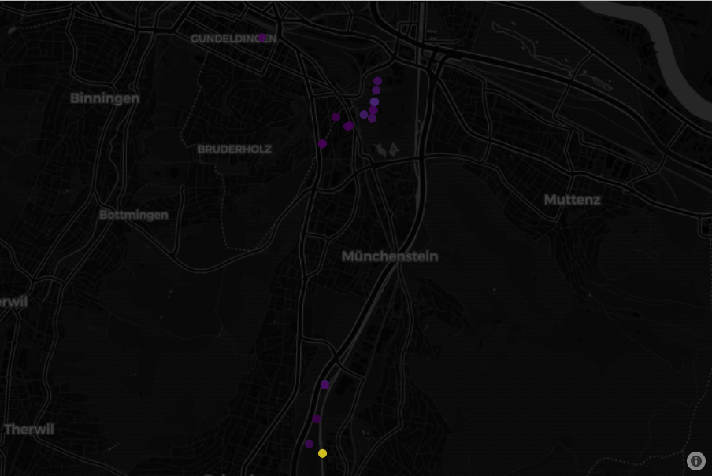

Bird locations
================
Timeo Wullschleger
2023-09-06

``` r
library(httr)
library(dplyr)
library(jsonlite)
library(plotly)
```

``` r
BASE_URL <- "https://data.mitwelten.org/api/v3/"
taxon.name <- "Alcedo atthis"
```

``` r
taxon_key_lookup <- function(name) {
  names <- tolower(unlist(strsplit(name, " ")))
  names[1] <-
    paste0(toupper(substr(names[1], 1, 1)), substr(names[1], 2, nchar(names[1])))
  formatted_name <- paste(names, collapse = " ")
  cat(paste("taxon key lookup for", formatted_name), "\n")
  # Encode the name for the URL
  encoded_name <- URLencode(formatted_name)
  # get taxon_key
  url <- paste0(BASE_URL, "taxonomy/sci/", encoded_name)
  req <- GET(url)
  if (status_code(req) != 200) {
    cat(paste(
      "invalid request. status code=",
      http_status(req)$status,
      "for url",
      url
    ),
    "\n")
    return(NULL)
  }
  taxonomy_tree <- content(req, "parsed")
  return(taxonomy_tree[[1]]$datum_id)
}

get_bird_locations <- function(taxon_key = NULL,
                               name = NULL,
                               confidence = 0.7,
                               time_from = NULL,
                               time_to = NULL,
                               distinct_species = FALSE) {
  if (is.null(taxon_key)) {
    if (!is.null(name)) {
      taxon_key <- taxon_key_lookup(name)
    } else {
      cat("No name or taxon_key provided.\n")
      return(NULL)
    }
  }
  
  params <- list(conf = confidence,
                 distinctspecies = distinct_species)
  
  if (!is.null(time_from)) {
    params[["from"]] <- time_from
  }
  
  if (!is.null(time_to)) {
    params[["to"]] <- time_to
  }
  
  url <- paste0(BASE_URL, "birds/", taxon_key, "/location")
  
  req <- GET(url, query = params)
  
  if (status_code(req) != 200) {
    cat(paste(
      "invalid request. status code=",
      status_code(req),
      "for url",
      url
    ),
    "\n")
    return(NULL)
  }
  detections <- content(req, "text")
  detections <- fromJSON(detections)
  return(detections)
}
```

``` r
df <- get_bird_locations(name = taxon.name)
```

    ## taxon key lookup for Alcedo atthis

    ## No encoding supplied: defaulting to UTF-8.

``` r
summary(df)
```

    ##     location.lat        location.lon      detections     deployment_id    
    ##  Min.   :47.49657    Min.   :7.596165   Min.   :   1.0   Min.   :   1.00  
    ##  1st Qu.:47.50432    1st Qu.:7.606231   1st Qu.:   2.0   1st Qu.:   5.75  
    ##  Median :47.53382    Median :7.609423   Median :  26.0   Median :  62.50  
    ##  Mean   :47.52509    Mean   :7.609534   Mean   : 122.2   Mean   : 323.20  
    ##  3rd Qu.:47.53537    3rd Qu.:7.614671   3rd Qu.:  72.0   3rd Qu.: 559.75  
    ##  Max.   :47.54330    Max.   :7.615415   Max.   :1246.0   Max.   :1271.00

``` r
fig <- df
fig <- fig %>%
  plot_ly(
    lat = df$location$lat,
    lon = df$location$lon,
    type = "scattermapbox",
    hovertext = ~ paste(
      "deployment",
      df$deployment_id,
      "<br />",
      df$detections,
      " detections"
    ),
    mode = "markers",
    marker = list(color = df$detections, size = 12,colorscale="Viridis", opacity=0.8)
    
  )
fig <- fig %>%
  layout(mapbox = list(
    style =  'carto-darkmatter',
    zoom = 11.5,
    center = list(
      lon = mean(df$location$lon),
      lat = mean(df$location$lat)
    )
  ),
  margin=list(t=0,b=0,r=0,l=0))
```


