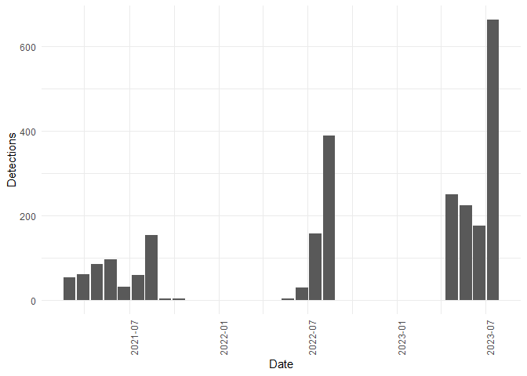

Bird detection dates
================
Timeo Wullschleger
2023-09-06

``` r
library(httr)
library(dplyr)
library(jsonlite)
library(ggplot2)
```

``` r
BASE_URL <- "https://data.mitwelten.org/api/v3/"
taxon.name <- "Alcedo atthis"
```

``` r
taxon_key_lookup <- function(name) {
  names <- tolower(unlist(strsplit(name, " ")))
  names[1] <-
    paste0(toupper(substr(names[1], 1, 1)), substr(names[1], 2, nchar(names[1])))
  formatted_name <- paste(names, collapse = " ")
  cat(paste("taxon key lookup for", formatted_name), "\n")
  # Encode the name for the URL
  encoded_name <- URLencode(formatted_name)
  # get taxon_key
  url <- paste0(BASE_URL, "taxonomy/sci/", encoded_name)
  req <- GET(url)
  if (status_code(req) != 200) {
    cat(paste(
      "invalid request. status code=",
      http_status(req)$status,
      "for url",
      url
    ),
    "\n")
    return(NULL)
  }
  taxonomy_tree <- content(req, "parsed")
  return(taxonomy_tree[[1]]$datum_id)
}

get_bird_detections <- function(taxon_key = NULL,
                                name = NULL,
                                confidence = 0.7,
                                bucket_width = "1d",
                                time_from = NULL,
                                time_to = NULL,
                                distinct_species = FALSE) {
  if (is.null(taxon_key)) {
    if (!is.null(name)) {
      taxon_key <- taxon_key_lookup(name)
    } else {
      cat("No name or taxon_key provided.\n")
      return(NULL)
    }
  }
  
  params <- list(conf = confidence,
                 bucket_width = bucket_width,
                 distinctspecies = distinct_species)
  
  if (!is.null(time_from)) {
    params[["from"]] <- time_from
  }
  
  if (!is.null(time_to)) {
    params[["to"]] <- time_to
  }
  
  url <- paste0(BASE_URL, "birds/", taxon_key, "/date")
  
  req <- GET(url, query = params)
  
  if (status_code(req) != 200) {
    cat(paste(
      "invalid request. status code=",
      status_code(req),
      "for url",
      url
    ),
    "\n")
    return(NULL)
  }
  detections <- content(req, "text")
  detections <- fromJSON(detections)
  result_df <- data.frame(time = detections$bucket,
                          values = detections$detections)
  return(result_df)
}
```

``` r
df <- get_bird_detections(name = taxon.name, bucket_width = "4w")
```

    ## taxon key lookup for Alcedo atthis

    ## No encoding supplied: defaulting to UTF-8.

``` r
summary(df)
```

    ##      time               values     
    ##  Length:17          Min.   :  3.0  
    ##  Class :character   1st Qu.: 32.0  
    ##  Mode  :character   Median : 86.0  
    ##                     Mean   :143.8  
    ##                     3rd Qu.:177.0  
    ##                     Max.   :664.0

``` r
# Create a ggplot bar plot
ggplot(df, aes(x = as.Date(time), y = values)) +
  geom_bar(stat = "identity") +
  labs(x = "Date", y = "Detections") +
  theme_minimal() +
  theme(axis.text.x = element_text(angle = 90, hjust = 1))
```

<!-- -->
