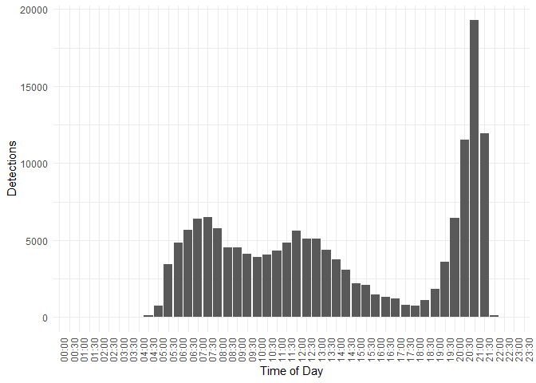

Birds Time Of Day
================
Timeo Wullschleger
2023-09-06

``` r
library(httr)
library(dplyr)
library(jsonlite)
library(ggplot2)
```

``` r
BASE_URL <- "https://data.mitwelten.org/api/v3/"
taxon.name <- "apus apus"
```

``` r
taxon_key_lookup <- function(name) {
  names <- tolower(unlist(strsplit(name, " ")))
  names[1] <-
    paste0(toupper(substr(names[1], 1, 1)), substr(names[1], 2, nchar(names[1])))
  formatted_name <- paste(names, collapse = " ")
  cat(paste("taxon key lookup for", formatted_name), "\n")
  # Encode the name for the URL
  encoded_name <- URLencode(formatted_name)
  # get taxon_key
  url <- paste0(BASE_URL, "taxonomy/sci/", encoded_name)
  req <- GET(url)
  if (status_code(req) != 200) {
    cat(paste(
      "invalid request. status code=",
      http_status(req)$status,
      "for url",
      url
    ),
    "\n")
    return(NULL)
  }
  taxonomy_tree <- content(req, "parsed")
  return(taxonomy_tree[[1]]$datum_id)
}

get_bird_tod <- function(
    taxon_key = NULL,
    name = NULL,
    confidence = 0.7,
    bucket_width_m = 60,
    time_from = NULL,
    time_to = NULL,
    distinct_species = FALSE
) {
  if (is.null(taxon_key)) {
    if (!is.null(name)) {
      taxon_key <- taxon_key_lookup(name)
    } else {
      cat("No name or taxon_key provided.\n")
      return(NULL)
    }
  }
  
  params <- list(
    conf = confidence,
    bucket_width_m = bucket_width_m,
    distinctspecies = distinct_species
  )
  
  if (!is.null(time_from)) {
    params[["from"]] <- time_from
  }
  
  if (!is.null(time_to)) {
    params[["to"]] <- time_to
  }
  
  url <- paste0(BASE_URL, "birds/", taxon_key, "/time_of_day")
  
  req <- GET(url, query = params)
  
  if (status_code(req) != 200) {
    cat(paste(
      "invalid request. status code=",
      status_code(req),
      "for url",
      url
    ),
    "\n")
    return(NULL)
  }
  
  detections <- content(req, "text")
  detections <- fromJSON(detections)
  
  result_df <- data.frame(
    minute_of_day = detections$minuteOfDay,
    values = detections$detections
  )
  
  return(result_df)
}
```

``` r
bird_tod_df <- get_bird_tod(name = taxon.name, bucket_width_m = 30)
```

    ## taxon key lookup for Apus apus

    ## No encoding supplied: defaulting to UTF-8.

``` r
summary(bird_tod_df)
```

    ##  minute_of_day        values        
    ##  Min.   :   0.0   Min.   :    1.00  
    ##  1st Qu.: 352.5   1st Qu.:   93.25  
    ##  Median : 705.0   Median : 2649.50  
    ##  Mean   : 705.0   Mean   : 3263.29  
    ##  3rd Qu.:1057.5   3rd Qu.: 4848.00  
    ##  Max.   :1410.0   Max.   :19269.00

``` r
bird_tod_df$hour <- floor(bird_tod_df$minute_of_day / 60)
bird_tod_df$minute <- bird_tod_df$minute_of_day %% 60


bird_tod_df$time_readable <- sprintf("%02d:%02d", bird_tod_df$hour, bird_tod_df$minute)

# Create a ggplot bar plot
ggplot(bird_tod_df, aes(x = time_readable, y = values)) +
  geom_bar(stat = "identity") +
  labs(x = "Time of Day", y = "Detections") +
  theme_minimal() +
  theme(axis.text.x = element_text(angle = 90, hjust = 1))
```

<!-- -->
