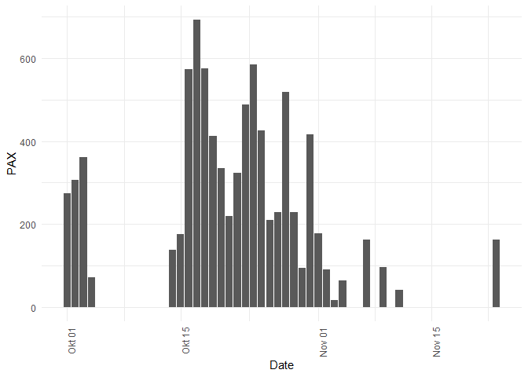
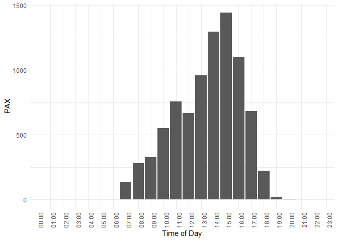

PAX
================
Timeo Wullschleger
2023-09-06

``` r
library(httr)
library(dplyr)
library(jsonlite)
library(ggplot2)
```

``` r
BASE_URL <- "https://data.mitwelten.org/api/v3/"
```

## Get a list of pax deployments

``` r
url <- paste0(BASE_URL, "deployments")
req <- GET(url)
  
if (status_code(req) != 200) {
  cat(paste(
    "invalid request. status code=",
    status_code(req),
    "for url",
    url
  ),
  "\n")
  return(NULL)
}
deployments <- content(req, "text", encoding = 'UTF-8')
deployments <- fromJSON(deployments)
pax_deployments <- deployments %>%
  filter(grepl("Pax", node$type, ignore.case = TRUE))
pax.ids <- pax_deployments$deployment_id
pax.ids
```

    ##  [1]   19   26   32   80   83   90   92   94  131  754  865 1382 1406 1431 1464
    ## [16] 1491 1540 1571 1577 1589 1663 1753 1760 1840 1909 1917 2044 2066 2092 2110
    ## [31] 2129

``` r
pax.id <- pax.ids[1]
```

## By date

``` r
get_pax_values <- function(deployment_id,
                                      bucket_width = "1d",
                                      time_from = NULL,
                                      time_to = NULL) {
  params <- list(bucket_width = bucket_width)
  
  if (!is.null(time_from)) {
    params[["from"]] <- time_from
  }
  
  if (!is.null(time_to)) {
    params[["to"]] <- time_to
  }
  
  url <- paste0(BASE_URL, "sensordata/pax/", deployment_id)
  
  req <- GET(url, query = params)
  
  if (status_code(req) != 200) {
    cat(paste(
      "invalid request. status code=",
      status_code(req),
      "for url",
      url
    ),
    "\n")
    return(NULL)
  }
  pax <- content(req, "text", encoding = 'UTF-8')
  pax <- fromJSON(pax)
  result_df <- data.frame(time = pax$buckets,
                          values = pax$pax)
  return(result_df)
}
```

``` r
df <- get_pax_values(pax.id)
summary(df)
```

    ##      time               values     
    ##  Length:33          Min.   :  0.0  
    ##  Class :character   1st Qu.: 94.0  
    ##  Mode  :character   Median :219.0  
    ##                     Mean   :256.5  
    ##                     3rd Qu.:412.0  
    ##                     Max.   :693.0

``` r
ggplot(df, aes(x = as.Date(time), y = values)) +
  geom_bar(stat = "identity") +
  labs(x = "Date", y = "PAX") +
  theme_minimal() +
  theme(axis.text.x = element_text(angle = 90, hjust = 1))
```

<!-- -->

## Time of day

``` r
get_pax_tod <- function(deployment_id,
                        bucket_width_m = 60,
                        time_from = NULL,
                        time_to = NULL) {
  params <- list(bucket_width_m = bucket_width_m)
  
  if (!is.null(time_from)) {
    params[["from"]] <- time_from
  }
  
  if (!is.null(time_to)) {
    params[["to"]] <- time_to
  }
  
  url <- paste0(BASE_URL, "sensordata/pax/", deployment_id,"/time_of_day")
  
  req <- GET(url, query = params)
  
  if (status_code(req) != 200) {
    cat(paste(
      "invalid request. status code=",
      status_code(req),
      "for url",
      url
    ),
    "\n")
    return(NULL)
  }
  pax <- content(req, "text", encoding = 'UTF-8')
  pax <- fromJSON(pax)
  result_df <- data.frame(time = pax$minuteOfDay,
                          values = pax$pax)
  return(result_df)
}
```

``` r
df <- get_pax_tod(pax.id)
summary(df)
```

    ##       time          values       
    ##  Min.   :   0   Min.   :   0.00  
    ##  1st Qu.: 345   1st Qu.:   1.75  
    ##  Median : 690   Median :  77.50  
    ##  Mean   : 690   Mean   : 352.62  
    ##  3rd Qu.:1035   3rd Qu.: 672.25  
    ##  Max.   :1380   Max.   :1442.00

``` r
df$hour <- floor(df$time / 60)
df$minute <- df$time %% 60


df$time_readable <- sprintf("%02d:%02d", df$hour, df$minute)

# Create a ggplot bar plot
ggplot(df, aes(x = time_readable, y = values)) +
  geom_bar(stat = "identity") +
  labs(x = "Time of Day", y = "PAX") +
  theme_minimal() +
  theme(axis.text.x = element_text(angle = 90, hjust = 1))
```

<!-- -->

## PAX by location

``` r
get_pax_locations <- function(time_from = NULL,
                              time_to = NULL) {
  params <- list()
  
  if (!is.null(time_from)) {
    params[["from"]] <- time_from
  }
  
  if (!is.null(time_to)) {
    params[["to"]] <- time_to
  }
  
  
  
  url <- paste0(BASE_URL, "sensordata/pax_locations")
  
  req <- GET(url, query = params)
  
  if (status_code(req) != 200) {
    cat(paste(
      "invalid request. status code=",
      status_code(req),
      "for url",
      url
    ),
    "\n")
    return(NULL)
  }
  detections <- content(req, "text", encoding = 'UTF-8')
  detections <- fromJSON(detections)
  return(detections)
}
```

``` r
df <-  get_pax_locations()
summary(df)
```

    ##     location.lat        location.lon         pax         deployment_id 
    ##  Min.   :47.49498    Min.   :7.603570   Min.   :   120   Min.   :  19  
    ##  1st Qu.:47.49857    1st Qu.:7.605754   1st Qu.:  5098   1st Qu.: 424  
    ##  Median :47.50369    Median :7.606274   Median : 20097   Median :1491  
    ##  Mean   :47.51274    Mean   :7.608015   Mean   : 45503   Mean   :1214  
    ##  3rd Qu.:47.53359    3rd Qu.:7.610287   3rd Qu.: 31813   3rd Qu.:1756  
    ##  Max.   :47.53624    Max.   :7.614397   Max.   :448204   Max.   :2129
