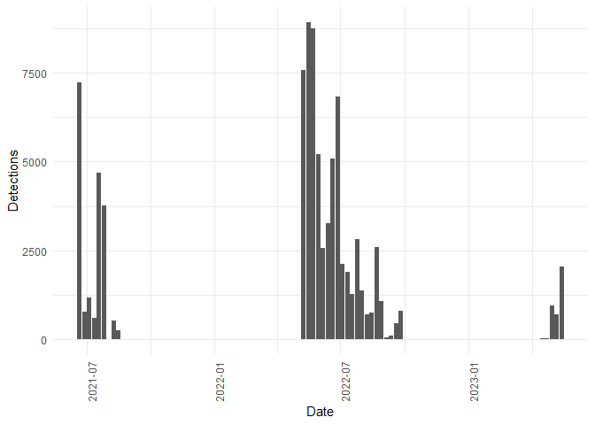
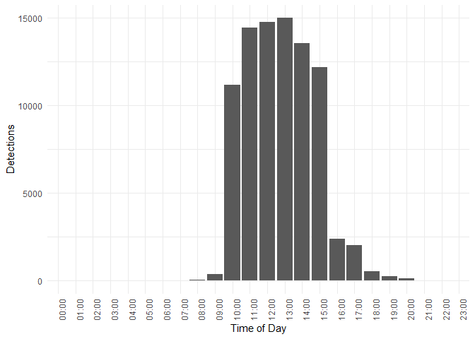
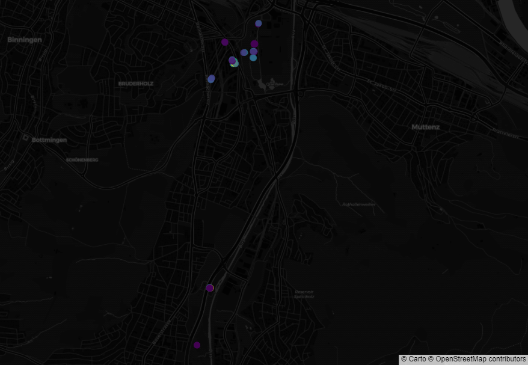

Pollinators
================
Timeo Wullschleger
2023-09-06

``` r
library(httr)
library(dplyr)
library(jsonlite)
library(plotly)
```

``` r
BASE_URL <- "https://data.mitwelten.org/api/v3/"
pollinator.cats <-
  list(
    all = NULL,
    apis = "honigbiene",
    apidae = "wildbiene",
    bombus = "hummel",
    muscidae = "fliege",
    syrphidae = "schwebfliege"
  )

category <- pollinator.cats$bombus
```

## Detections by date

``` r
get_pollinator_detections <- function(category = NULL,
                                      confidence = 0.7,
                                      bucket_width = "1d",
                                      time_from = NULL,
                                      time_to = NULL) {
  params <- list(conf = confidence,
                 bucket_width = bucket_width)
  
  if (!is.null(time_from)) {
    params[["from"]] <- time_from
  }
  
  if (!is.null(time_to)) {
    params[["to"]] <- time_to
  }
  
  if (!is.null(category)) {
    params[["pollinator_class"]] <- category
  }
  
  url <- paste0(BASE_URL, "pollinators/date")
  
  req <- GET(url, query = params)
  
  if (status_code(req) != 200) {
    cat(paste(
      "invalid request. status code=",
      status_code(req),
      "for url",
      url
    ),
    "\n")
    return(NULL)
  }
  detections <- content(req, "text")
  detections <- fromJSON(detections)
  result_df <- data.frame(time = detections$bucket,
                          values = detections$detections)
  return(result_df)
}
```

``` r
df <-  get_pollinator_detections(bucket_width = "1w")
```

    ## No encoding supplied: defaulting to UTF-8.

``` r
summary(df)
```

    ##      time               values    
    ##  Length:36          Min.   :   1  
    ##  Class :character   1st Qu.: 574  
    ##  Mode  :character   Median :1224  
    ##                     Mean   :2414  
    ##                     3rd Qu.:3396  
    ##                     Max.   :8932

``` r
ggplot(df, aes(x = as.Date(time), y = values)) +
  geom_bar(stat = "identity") +
  labs(x = "Date", y = "Detections") +
  theme_minimal() +
  theme(axis.text.x = element_text(angle = 90, hjust = 1))
```

<!-- -->

## Detections by time of day

``` r
get_pollinator_tod <- function(category = NULL,
                                      confidence = 0.7,
                                      bucket_width_m = 60,
                                      time_from = NULL,
                                      time_to = NULL) {
  params <- list(conf = confidence,
                 bucket_width_m = bucket_width_m)
  
  if (!is.null(time_from)) {
    params[["from"]] <- time_from
  }
  
  if (!is.null(time_to)) {
    params[["to"]] <- time_to
  }
  
  if (!is.null(category)) {
    params[["pollinator_class"]] <- category
  }
  
  url <- paste0(BASE_URL, "pollinators/time_of_day")
  
  req <- GET(url, query = params)
  
  if (status_code(req) != 200) {
    cat(paste(
      "invalid request. status code=",
      status_code(req),
      "for url",
      url
    ),
    "\n")
    return(NULL)
  }
  detections <- content(req, "text")
  detections <- fromJSON(detections)
  result_df <- data.frame(time = detections$minuteOfDay,
                          values = detections$detections)
  return(result_df)
}
```

``` r
df <-  get_pollinator_tod()
```

    ## No encoding supplied: defaulting to UTF-8.

``` r
summary(df)
```

    ##       time          values       
    ##  Min.   :   0   Min.   :    0.0  
    ##  1st Qu.: 345   1st Qu.:    0.0  
    ##  Median : 690   Median :   87.5  
    ##  Mean   : 690   Mean   : 3621.7  
    ##  3rd Qu.:1035   3rd Qu.: 4584.5  
    ##  Max.   :1380   Max.   :14979.0

``` r
df$hour <- floor(df$time / 60)
df$minute <- df$time %% 60


df$time_readable <- sprintf("%02d:%02d", df$hour, df$minute)

# Create a ggplot bar plot
ggplot(df, aes(x = time_readable, y = values)) +
  geom_bar(stat = "identity") +
  labs(x = "Time of Day", y = "Detections") +
  theme_minimal() +
  theme(axis.text.x = element_text(angle = 90, hjust = 1))
```

<!-- -->

## Detections by location

``` r
get_pollinator_locations <- function(category = NULL,
                                      confidence = 0.7,
                                      time_from = NULL,
                                      time_to = NULL) {
  params <- list(conf = confidence)
  
  if (!is.null(time_from)) {
    params[["from"]] <- time_from
  }
  
  if (!is.null(time_to)) {
    params[["to"]] <- time_to
  }
  
  if (!is.null(category)) {
    params[["pollinator_class"]] <- category
  }
  
  url <- paste0(BASE_URL, "pollinators/location")
  
  req <- GET(url, query = params)
  
  if (status_code(req) != 200) {
    cat(paste(
      "invalid request. status code=",
      status_code(req),
      "for url",
      url
    ),
    "\n")
    return(NULL)
  }
  detections <- content(req, "text")
  detections <- fromJSON(detections)
  return(detections)
}
```

``` r
df <-  get_pollinator_locations()
```

    ## No encoding supplied: defaulting to UTF-8.

``` r
summary(df)
```

    ##     location.lat        location.lon      detections     deployment_id    
    ##  Min.   :47.49660    Min.   :7.603510   Min.   :   1.0   Min.   :  20.00  
    ##  1st Qu.:47.53132    1st Qu.:7.606195   1st Qu.:  36.5   1st Qu.:  39.25  
    ##  Median :47.53377    Median :7.610337   Median :1514.0   Median :  56.50  
    ##  Mean   :47.52690    Mean   :7.610088   Mean   :2069.5   Mean   : 296.36  
    ##  3rd Qu.:47.53501    3rd Qu.:7.614371   3rd Qu.:3160.5   3rd Qu.: 789.00  
    ##  Max.   :47.53870    Max.   :7.615439   Max.   :8901.0   Max.   :1215.00

``` r
fig <- df
fig <- fig %>%
  plot_ly(
    lat = df$location$lat,
    lon = df$location$lon,
    type = "scattermapbox",
    hovertext = ~ paste(
      "deployment",
      df$deployment_id,
      "<br />",
      df$detections,
      " detections"
    ),
    mode = "markers",
    marker = list(color = df$detections, size = 12,colorscale="Viridis", opacity=0.8)
    
  )
fig <- fig %>%
  layout(mapbox = list(
    style =  'carto-darkmatter',
    zoom = 11.5,
    center = list(
      lon = mean(df$location$lon),
      lat = mean(df$location$lat)
    )
  ),
  margin=list(t=0,b=0,r=0,l=0))
```


